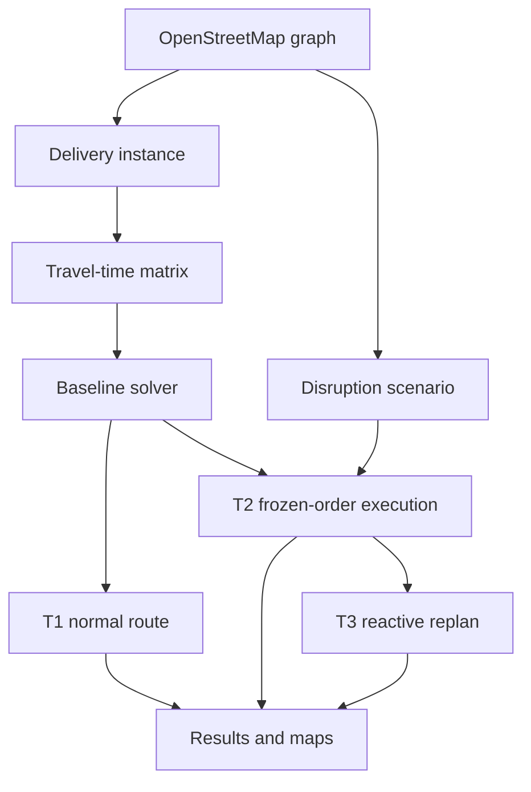
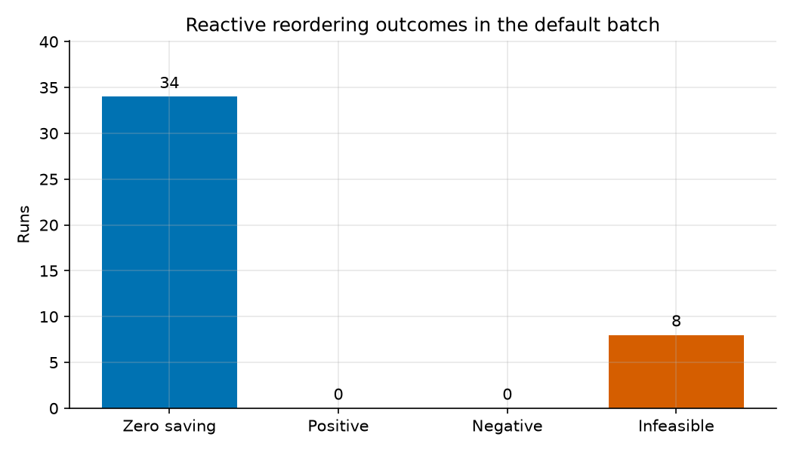
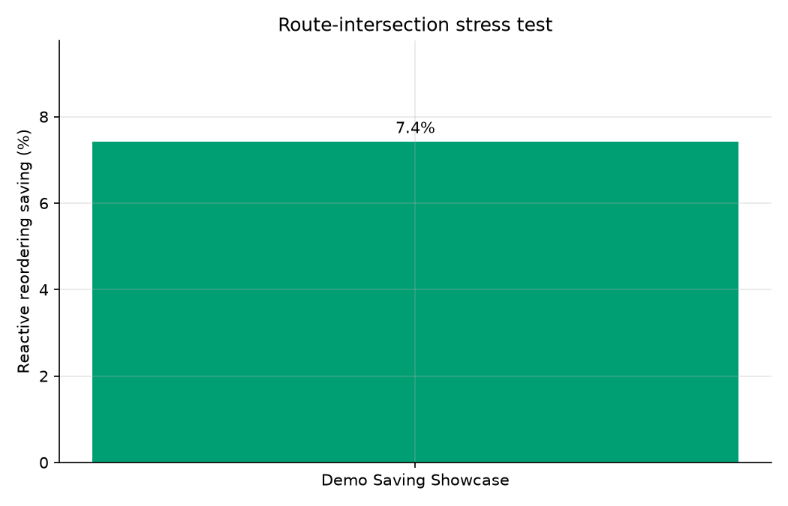

# Disruption-Aware Last-Mile Delivery Routing in Dublin

[](https://github.com/ACM40960/projects-rushikesh-shlok/actions/workflows/ci.yml)

Shlok Shetty (25206591) and Rushikesh Mane (25218847)
ACM40960 — Projects in Mathematics Modelling, University College Dublin

## Overview

This project investigates disruption-aware last-mile delivery routing
on a directed road network derived from OpenStreetMap data for Greater
Dublin. A baseline delivery order is constructed using nearest-neighbour
and improved using directed-cost 2-opt. Road closures and slow zones are
then applied to the graph, allowing the original route, a reactive
execution and a heuristic replan to be compared.

The project supports a dynamic number of delivery stops between 1 and
50, single- and multi-vehicle baseline routing, configurable disruption
scenarios, reproducible batch experiments, interactive Folium maps and a
Streamlit interface.

## Screenshot and demo


The reproducible positive-saving demonstration is:

```bash
dlm compare --instance demo_saving --scenario demo_saving_showcase
```

It is an engineered route-intersection stress test, not a typical-Dublin estimate.

## Research question

When a road disruption intersects a planned delivery route, how much can a
reactive stop-order replan reduce total route time compared with continuing the
original delivery order?

## Mathematical metrics

For a route visiting stops in order, the reported total is

\[
T = \sum_{(i,j)\in R} t_{ij} + \sum_{i\in S_R} s_i,
\]

where \(t_{ij}\) is directed shortest-path travel time and \(s_i\) is service
time at a completed delivery. The headline comparison is

\[
\operatorname{Saving}(\%) = \frac{T_2-T_3}{T_2}\times 100.
\]

- `T1`: baseline route under normal conditions.
- `T2`: the frozen stop order executed on the disrupted graph.
- `T3`: reactive replan from the first blockage to the remaining stops and real depot.
- `T3_oracle`: retained as an internal compatibility key for a from-scratch,
  full-disruption-knowledge heuristic. It is not a proven optimum or mathematical oracle.

## Pipeline



## Features

- Runtime-selected 1–50 stops: presets, addresses, coordinates, seeded random
  nodes and Streamlit map clicks.
- Directed Greater Dublin road graph with OSM `maxspeed` values and documented
  fallback speed assumptions.
- Single-vehicle nearest-neighbour and directed-cost 2-opt.
- Multi-vehicle capacitated Clarke–Wright baseline routing.
- OR-Tools CVRP/VRPTW benchmark with fractional-capacity scaling.
- Edge, node, corridor and polygon disruptions as closures or slow zones.
- Scenario-time selection and adjustable slow-zone speed in both the engine and UI.
- Reproducible batch, sensitivity, benchmark and route-intersection stress experiments.
- PNG/SVG report figures, Folium maps, CLI commands and a Streamlit interface.

## Algorithms

The main single-vehicle heuristic starts with nearest-neighbour and applies
2-opt with full directed-cost re-evaluation. Fleet baselines use parallel
Clarke–Wright savings followed by per-route 2-opt. `T2` preserves the stop order:
the omniscient model recomputes each leg before departure, while the reactive
model follows the original path until it reaches a removed edge. `T3` then
optimises the remaining open path from that blockage to the true depot.

OR-Tools is a comparison solver. Its result within a fixed time limit is not
described as a proof of optimality.

## Headline results

| Experiment | Result |
|---|---:|
| Default batch size | 42 instance-scenario pairs |
| T2 reactive feasible | 34/42 |
| T3 feasible | 34/42 |
| T2 omniscient feasible | 35/42 |
| Full-knowledge heuristic feasible | 35/42 |
| Mean reactive saving in default batch | 0.0% |
| Engineered bridge-closure stress-test saving | 7.4% |
| Small solver gap versus OR-Tools | 1.5% |
| Medium solver gap versus OR-Tools | 0.4% |
| Large solver gap versus OR-Tools | 15.8% |
| Fleet solver gap versus OR-Tools | 1.8% |

The default batch did not show a positive reordering saving. All 30 uniformly
sampled network disruptions changed real graph edges but missed the tested
delivery routes. Feasible curated cases either did not trigger stop-order
reoptimisation or produced the same route cost.

The separately identified `demo_saving_showcase` scenario is a reproducible
route-intersection stress test. It closes Samuel Beckett Bridge on an early
baseline leg and produces a 7.4% saving from reactive reoptimisation. It shows
that the mechanism can help when a disruption intersects a route while useful
stop-order choices remain; it is not presented as an average Dublin outcome.





## Quick start

### Linux, macOS or WSL

```bash
git clone https://github.com/ACM40960/projects-rushikesh-shlok.git
cd projects-rushikesh-shlok
make setup
make test
make reproduce
make app
```

### Windows PowerShell

```powershell
git clone https://github.com/ACM40960/projects-rushikesh-shlok.git
cd projects-rushikesh-shlok
py -3.11 -m venv .venv
Set-ExecutionPolicy -Scope Process -ExecutionPolicy Bypass
.\.venv\Scripts\Activate.ps1
python -m pip install --upgrade pip
pip install -e ".[dev,ui,fleet]"
pytest --cov=dlm --cov-report=term-missing
dlm network build
dlm batch
dlm sensitivity
dlm benchmark
dlm stress-test
dlm figures
streamlit run app/main.py
```

## CLI examples

```bash
dlm instance show --name small
dlm plan --instance small
dlm compare --instance small --scenario luas_works_dawson_street --at-time 600
dlm disrupt preview --scenario st_patricks_day_parade --at-time 1800
dlm benchmark --time-limit 10
```

See [docs/cli.md](docs/cli.md) for the full command reference.

## Streamlit

Run `streamlit run app/main.py`. The interface can create and edit instances,
plan single- or multi-vehicle baselines, select scenario time, adjust slow-zone
speed, and compare `T1`, reactive/omniscient `T2`, `T3`, and the full-knowledge
heuristic. Fleet disruption comparison is explicitly unsupported.

## Repository structure

| Path | Purpose |
|---|---|
| `src/dlm/` | Routing, disruption, simulation, metrics and visualisation library |
| `app/` | Streamlit thin client |
| `data/instances/` | Canonical delivery instances |
| `data/cache/` | Pinned graph and regenerable local caches |
| `scenarios/` | Saved disruption scenarios |
| `tests/` | Offline and pinned-real-network tests |
| `docs/report/` | Reproducible CSV results and figures |
| `docs/stages/` | Development-stage evidence |

## Reproducibility

- Tested locally with Python 3.12.13; CI covers Python 3.11 and 3.12.
- OSMnx range: `>=2.1,<2.2`; pinned snapshot built with OSMnx 2.1.1.
- Graph: `data/cache/dublin_drive_664cee449591eb29.pkl`.
- Graph SHA-256: `355dec5c53269f9e7e92d03c539c9e9ae080210b42c5f1f73f100c37e38e5e0f`.
- Graph size: 28,112 nodes and 62,068 directed edges.
- Random seed: 42.
- Default service time: 180 seconds per stop.
- Solvers: `nn_2opt`, `nearest_neighbour`, `clarke_wright_2opt`, OR-Tools.
- OR-Tools benchmark time limit: 10 seconds per instance.
- Full reproduction time in the verified environment: approximately 11 minutes.
- Outputs: `docs/report/*.csv`, `docs/report/figures/*` and ignored timestamped `results/` runs.

Run `make reproduce` after any modelling change; do not update prose numbers
without regenerating the committed CSV files and figures.

## Limitations

The model uses static free-flow speeds and no live traffic. Severity is stored
as descriptive metadata but does not affect routing. Slow zones change travel
cost but do not trigger T3 stop reordering; T3 is blockage-triggered. There is
no fuel/emissions model, no fleet-aware T2/T3, and no interactive disruption-
geometry editor. Random network-wide disruptions rarely intersect a small
delivery route. All main solvers are heuristics, and the Streamlit application
is single-user coursework software rather than a production dispatcher. See
[docs/limitations.md](docs/limitations.md).

## Data attribution

The pinned road graph is derived from OpenStreetMap and remains subject to the
Open Database License. See [DATA_NOTICE.md](DATA_NOTICE.md). The graph pickle is
a checksum-verified trusted repository artifact; arbitrary uploaded pickle
files are never accepted.

## Contributions

The repository history records the following work:

- Rushikesh Mane: initial stages 0–10, including the network, instance/matrix,
  solver, disruption, experiment, fleet, benchmark, hardening and Streamlit implementations.
- Shlok Shetty: pinned reproducible Dublin graph/demo, cross-version route-cost
  reproducibility, final correctness audit, validation, corrected T3 endpoint,
  adjustable disruptions, regenerated experiments, figures and documentation.

## Licence

The software is released under the [MIT License](LICENSE). The
OpenStreetMap-derived graph remains subject to the ODbL terms described in
[DATA_NOTICE.md](DATA_NOTICE.md); the MIT License does not replace those data
licence terms.
