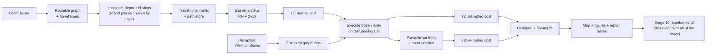

# Architecture

First draft, written in Stage 0. This will be finalised in Stage 9 once
every module exists and the real data flow (rather than the planned one) is
known.

## Pipeline (planned)

## Module responsibilities

| Module | Responsibility | Lands in |
|---|---|---|
| `dlm.config` | Paths, seed, units policy, log level — the single source of defaults | Stage 0 |
| `dlm.logging_conf` | Structured logging setup | Stage 0 |
| `dlm.network` | Download/cache the Dublin graph, impute travel times, snap points | Stage 1 |
| `dlm.instance` | Depot/Stop/Instance schema, mutable builder, presets, geocoding, travel-time matrix | Stages 2–3 |
| `dlm.solver` | `Solver` protocol, Nearest Neighbour + 2-opt, Clarke-Wright, OR-Tools benchmark | Stages 4, 8 |
| `dlm.disruption` | Scenario schema, application engine, generators, curated library | Stage 5 |
| `dlm.simulation` | Route execution under an information model, re-planning, T1/T2/T3/Saving % | Stage 6 |
| `dlm.viz` | Folium interactive maps, matplotlib report figures | Stages 2, 4–7 |
| `dlm.cli` | Typer CLI — the only way `app/` is allowed to reach the pipeline | All stages |
| `app/` | Streamlit thin client: widget layout and session-state plumbing only, no domain logic | Stage 10 |

## Architectural law: the UI is a thin client

Every capability the Stage 10 UI exposes must already exist as a tested CLI
command by Stage 9. If routing, solving, disruption, or metric logic is
found inside `app/`, that is a bug in the architecture, not a stylistic
preference — move it into `src/dlm/` and expose it through `dlm.cli` first.
`tests/test_cli_ui_parity.py` (Stage 10) enforces this: the same inputs
through the CLI and through the UI's underlying function calls must produce
identical `T1`/`T2`/`T3`.

## Determinism and caching

Every stochastic operation takes an explicit seed (default from
`dlm.config.settings.seed`). Expensive artefacts — the Dublin graph
download, the travel-time matrix — are cached to `data/cache/` keyed by a
hash of their inputs, so repeat runs are fast and two runs with the same
config are byte-identical. See each stage's own doc for its specific cache
key.
