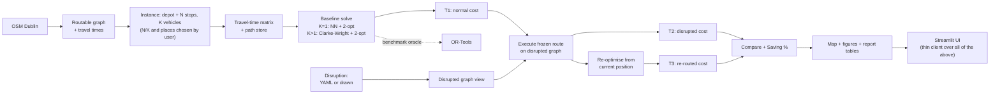

# Architecture

Complete as of Stage 10: every module below exists, is tested, and is
wired into `dlm.cli` (see `docs/cli.md` for the full command reference),
with `app/` as the thin client over all of it. This document was a
forward-looking draft from Stage 0 through Stage 8; the pipeline it now
describes is the real one, not a planned one — the diagram matches
actual data flow through `dlm.network` / `dlm.instance` / `dlm.solver` /
`dlm.disruption` / `dlm.simulation` / `dlm.viz`, as exercised by `make
reproduce` and, one layer up, by `app/main.py`.

## Pipeline

The OR-Tools branch (`Z`) is a benchmark oracle only (Stage 8) — it never
feeds `T1`/`T2`/`T3`, it exists to answer "how far is the hand-implemented
solver from OR-Tools' answer," reported via `dlm benchmark`.

## Module responsibilities

| Module | Responsibility | Landed in |
|---|---|---|
| `dlm.config` | Paths, seed, units policy, log level — the single source of defaults | Stage 0 |
| `dlm.logging_conf` | Structured logging setup | Stage 0 |
| `dlm.network` | Download/cache the Dublin graph, impute travel times, snap points | Stage 1 |
| `dlm.instance` | Depot/Stop/Instance schema, mutable builder, presets, geocoding, travel-time matrix | Stages 2–3 |
| `dlm.solver` | `Solver` protocol, Nearest Neighbour + 2-opt, Clarke-Wright (fleet), OR-Tools benchmark | Stages 4, 8 |
| `dlm.disruption` | Scenario schema, application engine, seeded random generators, curated library | Stages 5, 7 |
| `dlm.simulation` | Route execution under an information model, re-planning, T1/T2/T3/Saving % | Stage 6 |
| `dlm.viz` | Folium interactive maps, matplotlib report figures | Stages 2, 4–7 |
| `dlm.cli` | Typer CLI — the only way `app/` is allowed to reach the pipeline | All stages |
| `app/` | Streamlit thin client: widget layout and session-state plumbing only, no domain logic (`app/state.py` orchestrates `dlm.*` calls, `app/main.py` is widgets only) | Stage 10 |

## What each stage actually added to the pipeline

- **Stage 1** made `A -> B` real (OSMnx download, cached, travel times
  imputed from `maxspeed`).
- **Stage 2** made `C` real and user-driven (address/lat-lon/preset/
  random stops, not fixed test fixtures).
- **Stage 3** made `D` real and incremental (cached travel-time matrix,
  built once per instance's node set).
- **Stage 4** made `E -> F` real (`T1`, via NN + 2-opt).
- **Stage 5** made `G -> H` real (scenario YAML resolved against the
  pristine graph into a disrupted graph view).
- **Stage 6** made `I -> J -> K -> L -> M` real (`T2`/`T3`/`Saving %`
  under an explicit information model).
- **Stage 7** made the pipeline repeatable at scale (`dlm batch` running
  many (instance, scenario) pairs at once) and turned `M` into `N`
  (figures, sensitivity).
- **Stage 8** extended `C`/`E` to `K>1` (fleet, Clarke-Wright) and added
  the `Z` benchmark branch (OR-Tools).
- **Stage 9** didn't add a pipeline stage — it closed the loop: `make
  reproduce` runs the whole diagram end to end from a cold cache,
  `docs/cli.md` documents every entry point into it, and
  `docs/limitations.md` consolidates what it doesn't model.
- **Stage 10** added `O`: `app/main.py`, a Streamlit thin client whose
  every action calls `app/state.py`, which calls the same `dlm.*`
  functions `dlm.cli` calls — never a second implementation.

## Architectural law: the UI is a thin client

Every capability the UI exposes must already exist as a tested CLI
command. If routing, solving, disruption, or metric logic is found inside
`app/`, that is a bug in the architecture, not a stylistic preference —
move it into `src/dlm/` and expose it through `dlm.cli` first.
`tests/test_cli_ui_parity.py` enforces this concretely: it runs `dlm
plan`/`dlm compare` in-process and asserts the UI's underlying function
calls (`app.state.run_plan`/`run_compare`) produce identical `T1`/`T2`/
`T3` for the same inputs.

## Determinism and caching

Every stochastic operation takes an explicit seed (default from
`dlm.config.settings.seed`). Expensive artefacts — the Dublin graph
download, the travel-time matrix — are cached to `data/cache/` keyed by a
hash of their inputs, so repeat runs are fast and two runs with the same
config are byte-identical. See each stage's own doc for its specific cache
key.
