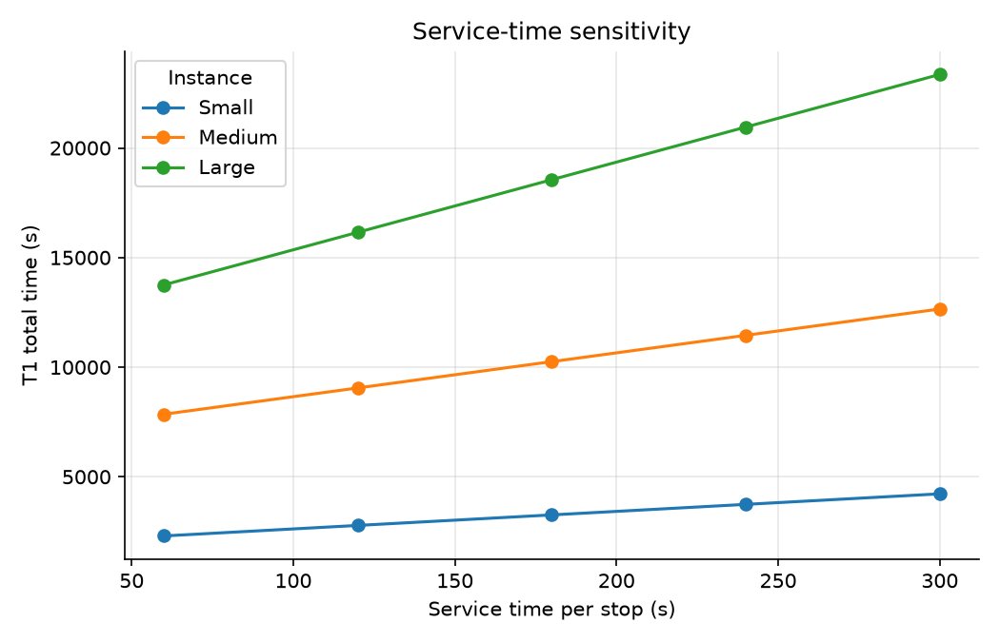
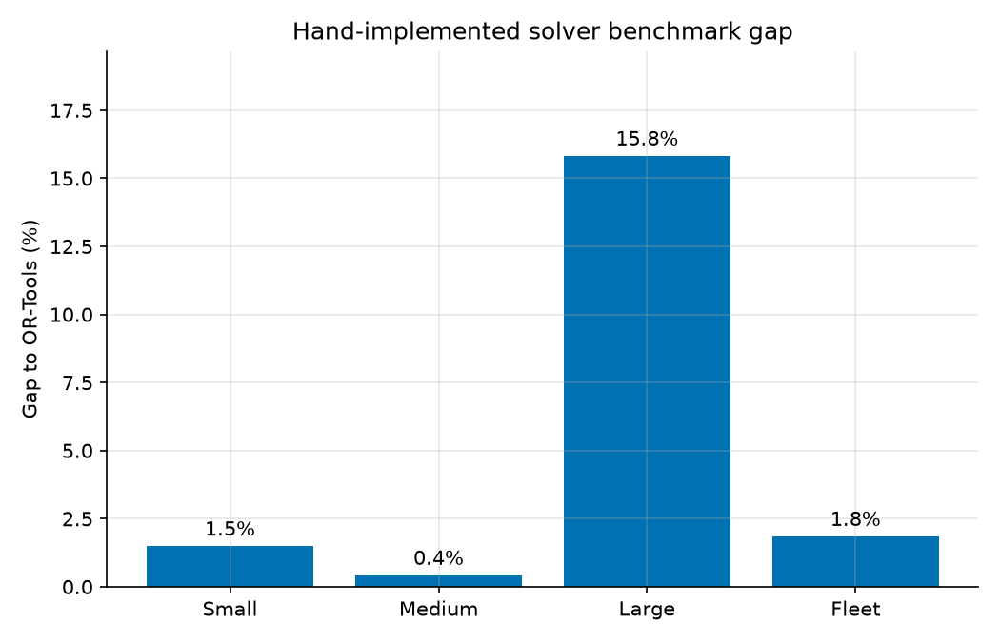

# Stage 7 — Reproducible experiments and results

## Commands

The committed evidence is regenerated with:

```bash
dlm batch
dlm sensitivity
dlm benchmark
dlm stress-test
dlm figures
```

`make reproduce` runs the graph build and these commands in dependency order.

## Default batch design

The default batch crosses three instances (`small`, `medium`, `large`) with
four curated illustrative scenarios and ten seeded network-wide random
scenarios. This gives 42 instance-scenario pairs. Random generation uses seed
42 and changes real graph edges; it is not targeted at the delivery routes.

## Feasibility

| Information model | Feasible | Infeasible |
|---|---:|---:|
| T2 omniscient | 35/42 | 7/42 |
| T2 reactive | 34/42 | 8/42 |
| T3 reactive replan | 34/42 | 8/42 |
| Full-knowledge heuristic (`T3_oracle` field) | 35/42 | 7/42 |

T2 reactive and T3 were feasible in 34/42 runs. T2 omniscient and the T3
full-knowledge heuristic were feasible in 35/42 runs. The extra feasible case
is the small-instance Liffey Quays closure: advance knowledge can avoid the
blocked approach, while a reactive driver reaches a node with no detour.


## Reactive saving

All 34 feasible default-batch pairs recorded exactly 0% reactive reordering
saving. The remaining eight pairs were infeasible, so their saving is
undefined. The clearer count chart replaces the former all-zero histogram.


All 30 uniformly sampled random disruptions changed real network edges but
missed the tested delivery routes. This result is retained: uniformly sampled
network disruptions rarely intersect a small delivery route. The feasible
curated cases either did not trigger T3 or produced the same route cost.

## Route-intersection stress test

`demo_saving_showcase` is a separately reported, reproducible stress test. It
closes Samuel Beckett Bridge on an early baseline leg of `demo_saving`:

| Metric | Result |
|---|---:|
| T1 | 4672.2 s |
| T2 reactive | 4927.3 s |
| T3 corrected path replan | 4561.4 s |
| Saving | 7.4% |

This establishes that reactive reordering can help when a disruption actually
intersects the route at a point where meaningful stop-order choices remain. It
is not an average or typical Dublin result.


## Curated route costs

The per-scenario comparison figure uses the small instance and human-readable
scenario labels. Infeasible values are annotated rather than drawn as zero.


## Service-time sensitivity

At the default 180 seconds per stop, service contributes 44.2% of small-instance
T1, 35.1% of medium-instance T1 and 38.8% of large-instance T1. This confirms
that the assumption materially changes the headline total even though it does
not change the stop order when all stops are served.



## OR-Tools benchmark

| Instance | Hand solver gap to OR-Tools |
|---|---:|
| Small | 1.5% |
| Medium | 0.4% |
| Large | 15.8% |
| Fleet | 1.8% |

The large-instance gap is reported explicitly; the comparison is not restricted
to the favourable small and medium cases. OR-Tools had a ten-second time limit
per instance and is a benchmark solver rather than a proof of optimality.



## Reproducibility record

- Python tested locally: 3.12.13; CI matrix: 3.11 and 3.12.
- Graph: `dublin_drive_664cee449591eb29.pkl`.
- Graph size: 28,112 nodes, 62,068 directed edges.
- Graph SHA-256: `355dec5c53269f9e7e92d03c539c9e9ae080210b42c5f1f73f100c37e38e5e0f`.
- Seed: 42.
- Default service time: 180 seconds.
- Full reproduction in the verified environment: approximately 11 minutes.

The source tables are `docs/report/batch_results.csv`,
`sensitivity_results.csv`, `benchmark_results.csv` and
`stress_test_results.csv`.
