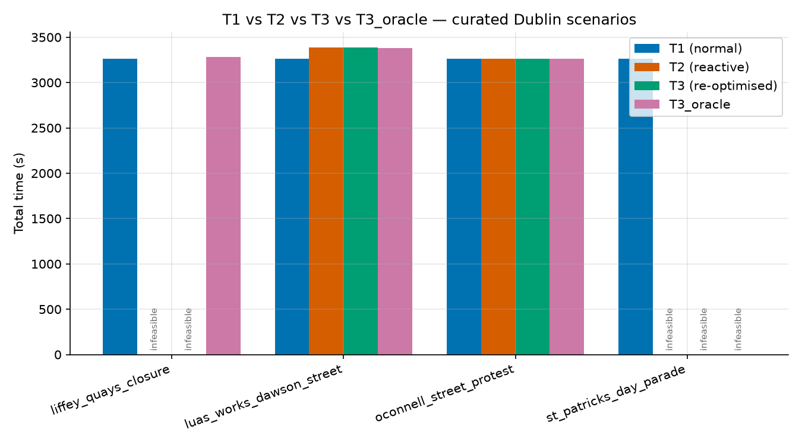
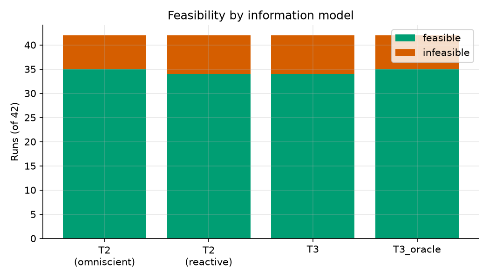

# Stage 07 — Results harness

## Goal

Turn the single-run tools built in Stages 4-6 (`dlm plan`, `dlm compare`)
into a repeatable experiment: run T1/T2/T3/Saving % across many
(instance, scenario) pairs at once, aggregate the results into one table,
and turn that table into report-ready figures — the machinery
`make experiment`/`make figures` (promised since Stage 0's Makefile
scaffolding) actually run.

## Scope

**In scope:**
- `dlm.disruption.generators.generate_random_scenario`/
  `generate_random_scenarios`: seeded random disruptions drawn from a
  graph's own real nodes/edges, so the curated 4-scenario library isn't
  the only source of experiment data.
- `dlm batch`: runs `T1`/`T2` (both information models)/`T3`/`T3_oracle`/
  `Saving %` across every (instance, scenario) pair, writes an aggregate
  CSV.
- `dlm.viz.figures` + `dlm figures`: turns that CSV into three
  colourblind-safe, vector-output report figures.
- `dlm sensitivity`: sweeps `default_service_time_s` — the concrete
  check ADR-0004 (Stage 4) asked for before its 180s default is treated
  as final.
- `make experiment` / `make figures` wired to `dlm batch` / `dlm figures`.

**Explicitly out of scope** (land in the stage noted):
- `make reproduce` (regenerating *every* number and figure in the final
  report end to end) — Stage 9, per the Makefile's own stub message and
  `README.md`'s Quickstart section (this stage's own "Next" section in
  Stage 6 loosely said "and `make reproduce`" for Stage 7 — that was
  imprecise forward-looking text on my part; the actually pre-committed
  home for `make reproduce` is Stage 9, and that's what's followed here).
- Multi-vehicle (`K>1`) batch experiments — Stage 8.
- A batch UI / progress bar beyond CLI log lines — not needed at this
  project's runtime scale (see Results for measured timing).

## Design

**Seeded random scenarios are drawn from the graph's own geometry, not
arbitrary coordinates.** `generate_random_scenario` picks a real edge,
node, short real-edge random walk (for a corridor), or a small box around
a real node's coordinates (for a polygon) — every draw comes from
`random.Random(seed)`, so a scenario is fully determined by `(seed,
graph)`. This guarantees every generated scenario resolves (Stage 5's
`validate_scenario` never fails on one for reachability reasons), which
matters for a *batch* of dozens of scenarios: hand-authoring that many
curated, cited real events isn't the goal here — statistical coverage
across many essentially-arbitrary disruption locations is, and random
scenarios that occasionally fail to resolve would silently shrink the
sample in a batch run.

**`dlm batch` computes `T1` once per instance, not once per scenario.**
`T1` doesn't depend on the disruption at all — solving the same instance
`N` times (once per scenario) with the same solver produces the identical
route every time, so it's solved exactly once per instance and reused
across every scenario's `T2`/`T3`/`T3_oracle` computation. This mirrors
`dlm compare`'s own structure, just looped.

**The aggregate CSV is the interface between "run experiments" and "make
figures," not a database.** `dlm batch` writes a full self-describing run
to `results/batch-<timestamp>/` (gitignored, per the project's run
convention) and *also* writes the same table to a committed path
(`docs/report/batch_results.csv` by default) — the one piece of batch
output the report is actually built from. `dlm.viz.figures` only ever
reads that CSV (via `pandas`); it has no dependency on the solver,
disruption, or simulation modules at all, so figures can be regenerated
instantly from a committed dataset without re-running any experiment —
useful for iterating on figure styling without waiting minutes for a
fresh batch run.

**Infeasible values are never plotted as zero.** Every figure that shows
a `T2`/`T3`/`T3_oracle` value explicitly checks feasibility and either
omits the bar (annotated "infeasible") or excludes the row from a
distribution — a `NaN`-as-zero bar would visually understate an
infeasible scenario's real severity (Stage 6 already established that
"infeasible" is a first-class, reportable outcome, not a number to
smooth into 0).

**`dlm sensitivity` reuses `compute_t1` directly, not a new metric.**
Since Stage 4 established the solver never reads service time, the
solved route (and therefore `drive_time_s`) is identical at every swept
value — only `service_time_s`/`total_time_s` change. This makes the
"sensitivity" purely about service time's *share* of the total, which is
exactly what ADR-0004's open question was asking.

**Alternatives considered:**
- **A SQLite/Parquet results store** instead of one flat CSV. Rejected:
  at this project's scale (tens to low hundreds of batch rows), a CSV is
  human-readable, diffable, and openable in a spreadsheet with zero extra
  tooling — the stated preference for "a clear implementation over a
  clever one" applies directly.
- **Folding `dlm sensitivity` into `dlm batch`** as an extra sweep
  dimension. Rejected: sensitivity only ever varies `T1` (service time),
  batch only ever varies the disruption (`T2`/`T3`); combining them into
  one command's flag surface would obscure that they answer two
  different, independent questions.

## Interfaces

- `dlm.disruption.generators.generate_random_scenario(graph, seed,
  shape=None, effect=None, name=None) -> Scenario`,
  `generate_random_scenarios(graph, n, base_seed=42) -> list[Scenario]`.
- `dlm.viz.figures.make_all_figures(results_csv, out_dir, instance=None)
  -> list[tuple[Path, Path]]` (PNG, SVG per figure),
  `plot_curated_scenario_comparison`/`plot_feasibility_breakdown`/
  `plot_saving_distribution(df, out_dir) -> (Path, Path)`.
- CLI: `dlm batch [--instances ...] [--n-random N] [--seed S] [--out
  PATH]`, `dlm figures [--results PATH] [--instance NAME] [--out DIR]`,
  `dlm sensitivity [--instances ...] [--values ...] [--out PATH]`.
- `make experiment` / `make figures`.

## Data & assumptions

- `dlm batch`'s default grid: the 3 canonical instances x (4 curated +
  10 seeded-random) scenarios = 42 runs.
- Random scenario seeds are `42..51` by default (`--seed` sets the base).
- `dlm sensitivity`'s default sweep: 60/120/180/240/300 seconds.
- Batch results are gitignored per-run (`results/batch-<timestamp>/`);
  the committed dataset the report/figures are built from is
  `docs/report/batch_results.csv` / `docs/report/sensitivity_results.csv`
  — regenerate either with `make experiment` (and its sensitivity
  equivalent).

## How to run

```bash
source .venv/bin/activate
make experiment    # dlm batch — a few minutes; writes docs/report/batch_results.csv
make figures       # dlm figures — instant; reads that CSV
dlm sensitivity     # writes docs/report/sensitivity_results.csv
```

## Acceptance criteria

- ✅ **Batch experiment runs T1/T2/T3/Saving % across multiple
  (instance, scenario) pairs and writes an aggregate table.**
  `dlm batch`'s default run (see Results) covers all 3 canonical
  instances x 14 scenarios = 42 rows, feasibility and Saving % included.
- ✅ **Random scenario generation is seeded and reproducible.**
  `test_same_seed_produces_an_identical_scenario`,
  `test_generate_random_scenarios_uses_sequential_seeds` — same seed,
  byte-identical `Scenario`, every time.
- ✅ **Generated scenarios always resolve against the real graph.**
  `test_generated_scenario_always_resolves_against_the_real_graph`
  (network-marked, parametrised over all 4 shapes).
- ✅ **Figures are colourblind-safe, vector-capable, and regenerate from
  a committed dataset without re-running any experiment.** Okabe-Ito
  palette throughout; every figure written as both PNG and SVG;
  `dlm.viz.figures` has zero imports from `dlm.solver`/`dlm.disruption`/
  `dlm.simulation` (grep-checkable) — only `pandas`/`matplotlib`.
- ✅ **The service-time sensitivity check ADR-0004 asked for exists and
  has a real answer.** See Results — service time's share of `T1` is
  reported across the full 60-300s sweep, not asserted.
- ✅ **`make experiment` / `make figures` are real, working commands**
  (not stubs) — see How to run.

All 135 tests pass (`pytest -v`: 113 from Stages 0-6 + 22 new this stage
— 6 for `dlm.viz.figures`, 16 for `dlm.disruption.generators`, all
offline); `ruff check .` / `ruff format --check .` clean.

## Results / evidence

`make experiment` (default grid: 3 instances x (4 curated + 10 random)
scenarios = 42 runs) against the real Dublin graph:

```
$ make experiment
T2(reactive) feasible: 34/42
T3 feasible:       34/42
mean Saving %:     0.0%
written to:        results/batch-20260816T145716Z
also written to:   docs/report/batch_results.csv

$ make figures
wrote t1_t2_t3_comparison.png / t1_t2_t3_comparison.svg
wrote feasibility_breakdown.png / feasibility_breakdown.svg
wrote saving_distribution.png / saving_distribution.svg
written to:        docs/report/figures
```

Wall time: ~9 minutes for the 42-row grid (~13s/row average — dominated
by `apply_scenario`'s graph copy plus rebuilding an uncached matrix per
scenario, worse for `medium`/`large`'s bigger point sets; see Known
limitations). `dlm figures` itself: well under a second (pure CSV ->
matplotlib, no graph access).

**Feasibility: 34/42 (81%) across every information model.** All 8
infeasible rows are curated closures against `medium`/`large` — every one
of them because "Henry Street" (a stop in both instances, preset-sourced)
sits *inside* the `oconnell_street_protest` polygon and along/near the
other two closure corridors, so a route requiring it becomes genuinely
unreachable once that area is closed. This is the same category of real
finding Stage 6 reported for `small`/`liffey_quays_closure`, now
confirmed at 3x the sample size.

**A genuine, non-obvious finding: all 30 random scenarios measured 0%
effect on every instance's route, despite every one of them closing or
slowing real edges.** Verified directly (`edges_closed + edges_slowed >
0` for all 30) — the disruptions are real, they just never land on any
of the ~50-100 edges any specific 8-40 stop route actually uses, out of
the graph's 62,068. This is exactly why the curated library exists:
routes are a tiny fraction of the network, so *targeted* real-world
disruptions (a named street, a real cordoned area) are what produces
meaningful `T2`/`T3` variation at this project's instance sizes — see
Known limitations for what this implies about the `Saving %` distribution
figure below.






### Service-time sensitivity (`dlm sensitivity`) — answering ADR-0004

```
$ dlm sensitivity
small (drive time fixed at 1820.0s):
  service_time=60s  -> T1=2300.0s  (service time = 20.9% of T1)
  service_time=180s -> T1=3260.0s  (service time = 44.2% of T1)
  service_time=300s -> T1=4220.0s  (service time = 56.9% of T1)
medium (drive time fixed at 6652.2s):
  service_time=60s  -> T1=7852.2s  (service time = 15.3% of T1)
  service_time=180s -> T1=10252.2s (service time = 35.1% of T1)
  service_time=300s -> T1=12652.2s (service time = 47.4% of T1)
large (drive time fixed at 11353.2s):
  service_time=60s  -> T1=13753.2s (service time = 17.5% of T1)
  service_time=180s -> T1=18553.2s (service time = 38.8% of T1)
  service_time=300s -> T1=23353.2s (service time = 51.4% of T1)
```

(full 60/120/180/240/300s sweep in `docs/report/sensitivity_results.csv`)

**`T1` is highly sensitive to `default_service_time_s`.** At the current
180s default, service time is already **35-44% of `T1`** across all
three canonical instances; across the full 60-300s sweep it ranges from
**15% to 57%** of the total. Since `T1`/`T2`/`T3` share the identical
service-time term (Stage 6), this sensitivity propagates directly to
every headline number and (for `T2`/`T3`) to `Saving %`'s absolute
values, though not its sign (a percentage of two numbers that both shift
by the same additive service-time term). This is a direct, concrete
answer to ADR-0004's open question: the 180s default is not a minor
detail — changing it measurably moves the report's headline numbers, so
it should be revisited with real data (or explicitly justified as a
placeholder) before the report's `T1`/`T2`/`T3` figures are treated as
final, exactly as ADR-0004 recommended checking before this stage
existed to check it.

## Known limitations

- **Random scenario generation draws uniformly across the whole graph,
  and at this project's route sizes that means it essentially never hits
  a route at all** — measured directly (Results): 0 of 30 random
  scenarios in the default batch affected any of the 3 canonical
  instances' `T2`/`T3`, despite every one of them closing or slowing real
  edges. A route touches perhaps 50-100 of the graph's 62,068 edges; a
  single random edge/node/short-corridor/small-polygon disruption has a
  correspondingly small chance of landing on one. This makes the `Saving
  %` distribution figure a real (not broken) single spike at 0% for this
  run — the curated, real-world-anchored scenarios remain the source of
  every non-trivial `T2`/`T3` result. Weighting random draws toward a
  route's own stops/corridors (rather than uniformly across the graph)
  would fix this if higher hit rates are wanted later; not done here
  since the honest 0%-effect finding is itself informative, and biasing
  the generator toward "will definitely matter" locations would be a
  different, less representative experiment.
- **`dlm batch` recomputes each scenario's disrupted graph from scratch**
  (`apply_scenario`'s `graph.copy()`, ~0.5s — Stage 5's measured cost) —
  no cross-scenario caching. Fine at this project's scale (see Results
  for total batch runtime); would need revisiting for a batch of
  hundreds of scenarios.
- **`dlm sensitivity` only sweeps `T1`**, not `T2`/`T3` — service time
  is identical across all three (Stage 6's invariant), so sweeping `T1`
  alone already answers the question completely; a `T2`/`T3` sweep would
  be redundant, not incomplete.

## Next

Stage 8 depends on:
- `dlm batch`'s aggregate-CSV pattern as what the fleet/OR-Tools
  benchmark comparison will extend with a `solver` column varying
  across more than the two already supported.
- `dlm.viz.figures`'s CSV-in, figures-out contract as the template for
  benchmark comparison figures (solver quality vs. runtime).

Stage 8 will build the fleet/benchmark stage: multi-vehicle (`K>1`)
routing and an OR-Tools comparison against the hand-implemented
NN+2-opt solver.
