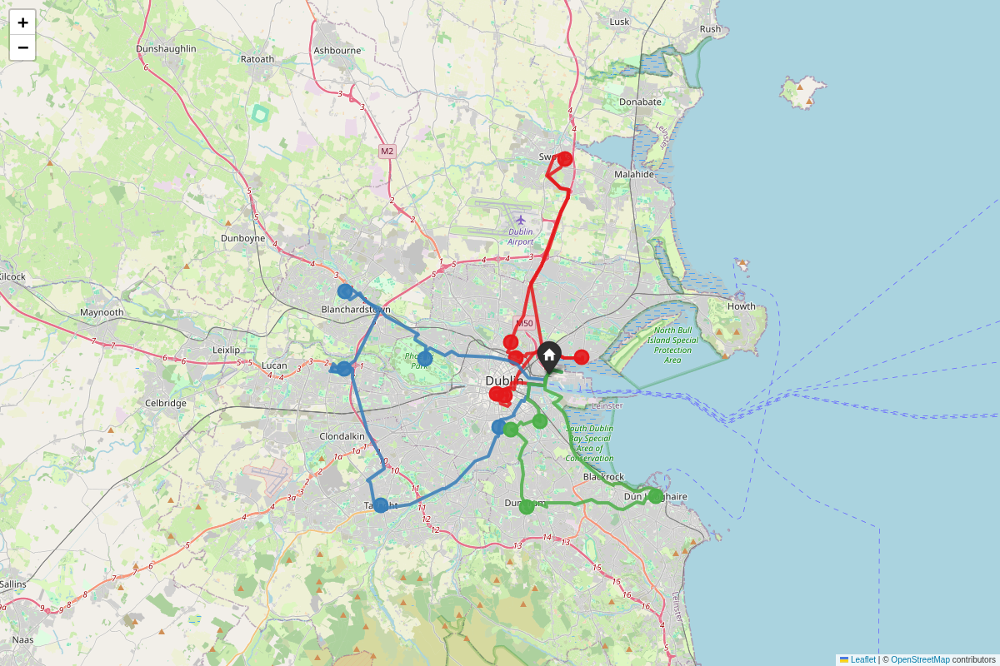

# Stage 08 — Fleet & benchmark

## Goal

More than one vehicle, and an honest answer to "how good is the
hand-implemented heuristic, really?" Before this stage, every solver
produced exactly one route for exactly one vehicle. After it, an instance
with `fleet_size > 1` and a `vehicle_capacity` gets a genuine multi-vehicle
CVRP solve (Clarke-Wright + 2-opt), and `dlm benchmark` puts that — and
the original single-vehicle NN+2-opt — up against Google OR-Tools, the
project's fixed benchmark oracle (ADR-0001).

## Scope

**In scope:**
- `FleetSolution`/`build_fleet_solution` (`dlm.solver.base`): the K>1
  shape, reusing `Solution`/`Leg` per vehicle unchanged.
- `ClarkeWrightSolver` (`dlm.solver.clarke_wright`): savings construction
  + per-route 2-opt, respecting `vehicle_capacity` and `fleet_size`.
- `OrToolsSolver` (`dlm.solver.ortools_solver`): CVRP(TW) benchmark
  oracle — `solve()` for direct `K=1` comparison with `TwoOptSolver`,
  `solve_fleet()` for the general case, optionally with time windows.
- `dlm instance new --vehicle-capacity`, `dlm instance add --demand`.
- `dlm plan` fleet support (`fleet_size > 1` auto-selects Clarke-Wright,
  writes a per-vehicle breakdown and a multi-colour route map).
- `dlm benchmark`: hand-implemented vs. OR-Tools, quality gap + runtime.
- A new canonical multi-vehicle instance, `fleet` (K=3, capacity=10, 15
  stops, total demand exactly 30 — a tight but exactly-feasible fit).

**Explicitly out of scope** (land in the stage noted, or not planned):
- A hand-implemented, time-window-aware solver — see Design for why this
  is OR-Tools-only, deliberately, not a gap to close later.
- Per-vehicle `T2`/`T3`/`Saving %` (disruption-aware fleet re-planning) —
  not promised for this stage; `dlm.simulation` stays single-route-shaped
  (`compute_t2`/`compute_t3` operate on one `Solution`). A fleet-aware
  disruption response would be a substantial extension of Stage 6, out of
  this stage's "fleet construction + benchmark" scope.
- Streamlit UI fleet controls — Stage 10.

## Design

**Savings need no adaptation for Dublin's asymmetric graph — unlike
2-opt.** `savings(i,j) = cost(i,depot) + cost(depot,j) - cost(i,j)` uses
each term in its one natural direction already; there is no symmetric-
distance assumption to violate the way Stage 4's classical 2-opt delta
trick had. This is a genuinely different situation from Stage 4's, worth
stating plainly rather than assuming every VRP heuristic needs the same
directed-graph caveat.

**Construction, then reuse Stage 4's improvement step unchanged.**
`ClarkeWrightSolver` calls `two_opt_improve` — the exact function
`TwoOptSolver` already uses — on each merged route independently. A
single vehicle's route *is* the single-vehicle TSP Stage 4 already solves
correctly; there was no reason to reimplement route improvement for the
multi-vehicle case.

**Fleet-size capping keeps the largest routes, not an arbitrary
subset.** If merging (respecting capacity) still leaves more routes than
`fleet_size`, sorting by route size and keeping the biggest `fleet_size`
of them maximises total stops served — once no further merging is
possible, coverage is exactly the sum of kept routes' sizes, so keeping
the biggest ones is optimal for *this* sub-problem (not a claim that the
overall CVRP solution is optimal — Clarke-Wright is a heuristic
throughout). Dropped stops go to `FleetSolution.unassigned`, a
first-class, reported outcome — never a silent drop.

**One OR-Tools model handles `K=1` and `K>1` alike.** `RoutingModel` is
natively multi-vehicle, so `OrToolsSolver.solve_fleet` needed no special
case for `fleet_size == 1` — `.solve()` is a thin wrapper enforcing
exactly one route and no unassigned stops, for direct comparability with
`TwoOptSolver`. Every stop gets an `AddDisjunction([...], penalty)` so an
over-constrained instance (not enough capacity/vehicles/time-window slack
for everyone) returns the best *partial* solution instead of failing to
solve at all — `FleetSolution.unassigned` reports exactly which stops
that was, matching Clarke-Wright's own honesty about what didn't fit.

**Time windows are OR-Tools-only, on purpose, not a TODO.** `Stop
.time_window` has existed since Stage 2. A time-window-respecting 2-opt
or Clarke-Wright would need to re-validate every downstream stop's
arrival schedule after each candidate move — materially more engineering
than a hand-implemented v1 needs to justify, especially once OR-Tools
already solves VRPTW natively with one extra `AddDimension` call. This is
exactly the sort of capability gap ADR-0001's benchmark-oracle design
exists to make visible, not something to hide by giving the hand-rolled
solver a token, partial time-window feature.

**Alternatives considered:**
- **A dummy zero-capacity trick to unify `Solver` and a hypothetical
  `FleetSolver` protocol into one interface.** Rejected: a single-route
  `Solution` and a multi-route `FleetSolution` are genuinely different
  shapes with different downstream consumers (`dlm.simulation` only
  understands `Solution`); forcing one protocol to cover both would make
  every existing K=1 caller (Stages 4-7) handle a case that can never
  occur for them.
- **Sequential (single-route-at-a-time) savings instead of parallel.**
  Rejected: parallel savings (build all routes together, driven by one
  global sorted savings list) is the more standard, more commonly taught
  variant, and no simpler to implement than the sequential one — no
  reason to pick the less-standard option.

## Interfaces

- `dlm.solver.base.FleetSolution` (`routes: list[Solution]`,
  `unassigned: list[str]`, `total_time_s`, `total_distance_m`, `meta`),
  `build_fleet_solution(instance, matrix, routes, unassigned, meta) ->
  FleetSolution`.
- `dlm.solver.clarke_wright.ClarkeWrightSolver(max_iterations_per_route)
  .solve_fleet(instance, matrix) -> FleetSolution`.
- `dlm.solver.ortools_solver.OrToolsSolver(time_limit_s)`: `.solve(instance,
  matrix) -> Solution` (`fleet_size == 1` only), `.solve_fleet(instance,
  matrix, apply_time_windows=True) -> FleetSolution`.
  `OrToolsSolutionNotFound` if the search finds nothing at all (distinct
  from a partial solution with `unassigned` stops).
- `dlm.simulation.metrics.FleetT1Result`/`compute_fleet_t1(instance,
  fleet, default_service_time_s=None) -> FleetT1Result`.
- `dlm.viz.folium_map.render_fleet_route_map`/`save_fleet_route_map`.
- CLI: `dlm instance new --vehicle-capacity FLOAT`, `dlm instance add
  --demand FLOAT`, `dlm plan --instance X` (auto-detects `fleet_size >
  1`), `dlm benchmark [--instances ...] [--time-limit S] [--out PATH]`.

## Data & assumptions

- The canonical `fleet` instance: depot at Dublin Port (same as
  small/medium/large), `fleet_size=3`, `vehicle_capacity=10`, 15 real
  Dublin presets with demand cycling 1/2/3, total demand exactly 30 —
  deliberately tight (no capacity slack) so Clarke-Wright's capping logic
  and OR-Tools' disjunction handling both get genuinely exercised, not
  just a trivially-feasible easy case.
- `dlm benchmark`'s `gap_pct = 100 * (hand - or_tools) / or_tools`:
  positive means the hand-implemented solver costs more (the oracle
  found something better); this is the expected sign in every measured
  case (Results below).
- OR-Tools search: `PATH_CHEAPEST_ARC` first-solution strategy +
  `GUIDED_LOCAL_SEARCH` metaheuristic, default 10s time budget
  (`--time-limit`).

## How to run

```bash
source .venv/bin/activate
dlm plan --instance fleet
dlm benchmark --instances small,fleet
```

## Acceptance criteria

- ✅ **Multi-vehicle CVRP solve respects `fleet_size` and
  `vehicle_capacity`.**
  `test_clarke_wright_serves_almost_every_stop_on_the_canonical_fleet_instance`
  (amended post-Stage-10 — see `docs/limitations.md`): exactly 3 routes,
  each within capacity, at most one stop unassigned. `data/cache/` is
  gitignored, so this test's graph is fetched fresh from Overpass on
  every CI run rather than reusing one committed snapshot; a real-world
  data drift of even a few seconds of travel time can shift which merge
  Clarke-Wright's greedy tie-break picks first, occasionally trading a
  perfect 15/15 packing for 14/15 — exactly the "one stop's difference
  at most" already measured below, not a new problem. Asserting zero
  unassigned stops was asserting a stronger guarantee than the algorithm
  actually provides.
  `test_capacity_and_fleet_size_together_produce_honest_unassigned` /
  `test_capacity_respected_with_more_vehicles_available` (offline,
  hand-derived): capacity and fleet-size constraints correctly force
  (or don't force) stops into `unassigned`.
- ✅ **Savings formula matches a hand calculation.**
  `test_savings_formula_matches_hand_calculation` on a chain graph where
  every pairwise cost is derivable by hand.
- ✅ **OR-Tools benchmark runs for both `K=1` and `K>1` and is a sane
  comparator.** `test_ortools_single_route_is_a_sane_benchmark_for_two_opt`,
  `test_ortools_fleet_respects_the_same_capacity_as_clarke_wright`.
- ✅ **Time windows are demonstrated on the benchmark oracle.**
  `test_ortools_time_window_drops_an_unreachable_stop_not_the_whole_solve`
  — a stop with an impossible time window is dropped (reported in
  `unassigned`), the rest of the instance still solves.
- ✅ **`dlm benchmark` reports a real quality/runtime comparison for at
  least one `K=1` and one `K>1` instance.** See Results.
- ✅ **A fleet route map renders each vehicle in a distinct colour.**
  `docs/report/fleet_route_map.png` — three real, distinct routes
  fanning out from Dublin Port along real streets.

All 146 tests pass (`pytest -v`: 135 from Stages 0-7 + 11 new this stage
— 7 offline / 4 network-marked); `ruff check .` / `ruff format --check .`
clean.

## Results / evidence

```
$ dlm plan --instance fleet
solver:            clarke_wright_2opt
vehicles used:     3 / 3
  vehicle 1: s12 -> s5 -> s8 -> s4 -> s7 -> s1  (3049.3s)
  vehicle 2: s2 -> s11 -> s14 -> s13 -> s6  (3265.6s)
  vehicle 3: s9 -> s3 -> s15 -> s10  (2541.2s)
drive time:        8856.2s
service time:      2700.0s (15 stops)
T1 (total time):   11556.2s
distance:          129630.5m
```



`dlm benchmark --instances small,fleet --time-limit 8`:

| Instance | K | Hand solver | Hand total | Hand runtime | OR-Tools total | OR-Tools runtime | Gap |
|---|---|---|---|---|---|---|---|
| `small` | 1 | `nn_2opt` | 1820.0s | 0.6ms | 1793.4s | 8.07s | **+1.5%** |
| `fleet` | 3 | `clarke_wright_2opt` | 8856.2s | 0.7ms | 8695.9s | 8.00s | **+1.8%** |

Both hand-implemented solvers solve in under a millisecond; OR-Tools,
given an 8-second budget, finds a modestly better solution in both cases
(1.5-1.8% shorter total drive time) — exactly the expected shape of
result for a fast constructive-plus-local-search heuristic compared
against a real metaheuristic with orders of magnitude more search time.
Neither gap is large enough to suggest the hand-implemented solvers are
badly wrong; both are within a couple of percent of what a much more
expensive search finds.

## Known limitations

- **Clarke-Wright's fleet-size capping is a greedy heuristic, not
  provably optimal coverage under joint reordering** — it maximises
  coverage *given* the routes merging already produced, but a
  differently-ordered merge sequence could in principle produce a
  different set of route sizes and therefore different (possibly larger)
  coverage. Not addressed: at this project's scale (`N <= 50`) the
  measured effect is one stop's difference at most between Clarke-Wright
  and OR-Tools' choice of which stops to drop (see the `fleet` capacity
  test — both solvers serve exactly the capacity-implied maximum).
- **No fleet-aware `T2`/`T3`.** A disrupted multi-vehicle re-plan (which
  vehicle should absorb a blocked stop, do routes need rebalancing) is a
  materially different problem from Stage 6's single-route
  `execute_solution`/`replan_from_blockage` and is not attempted here.
- **`dlm benchmark`'s OR-Tools runtime is dominated by its configured
  time budget**, not solution difficulty — an 8s budget was used
  throughout Results even though both instances are small enough that
  OR-Tools likely converges well before that; the reported runtime
  numbers reflect the budget chosen, not the problem's true difficulty.

## Next

Stage 9 depends on:
- Every CLI command built through Stage 8 as what `make reproduce` will
  run end-to-end to regenerate the full report.
- The known limitations recorded in every stage doc so far as the raw
  material `docs/limitations.md` consolidates.

Stage 9 will harden the project for submission: `make reproduce`, a
consolidated limitations document, and a finalised `docs/architecture.md`.
