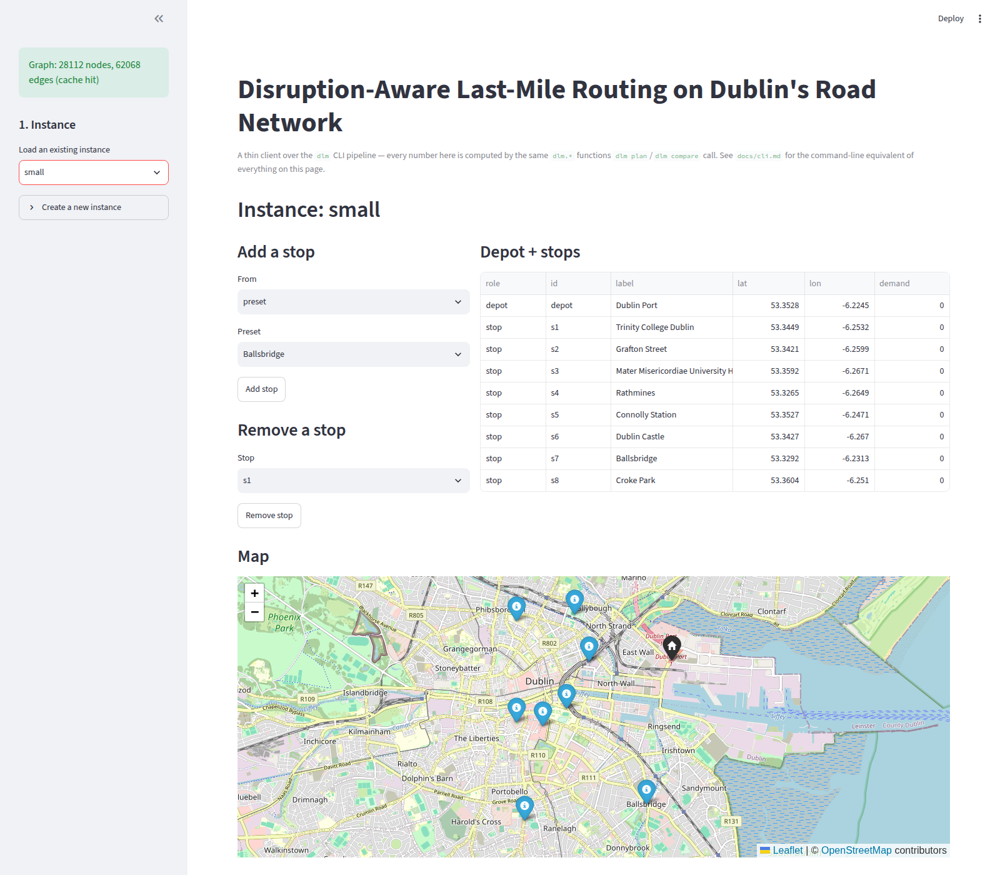
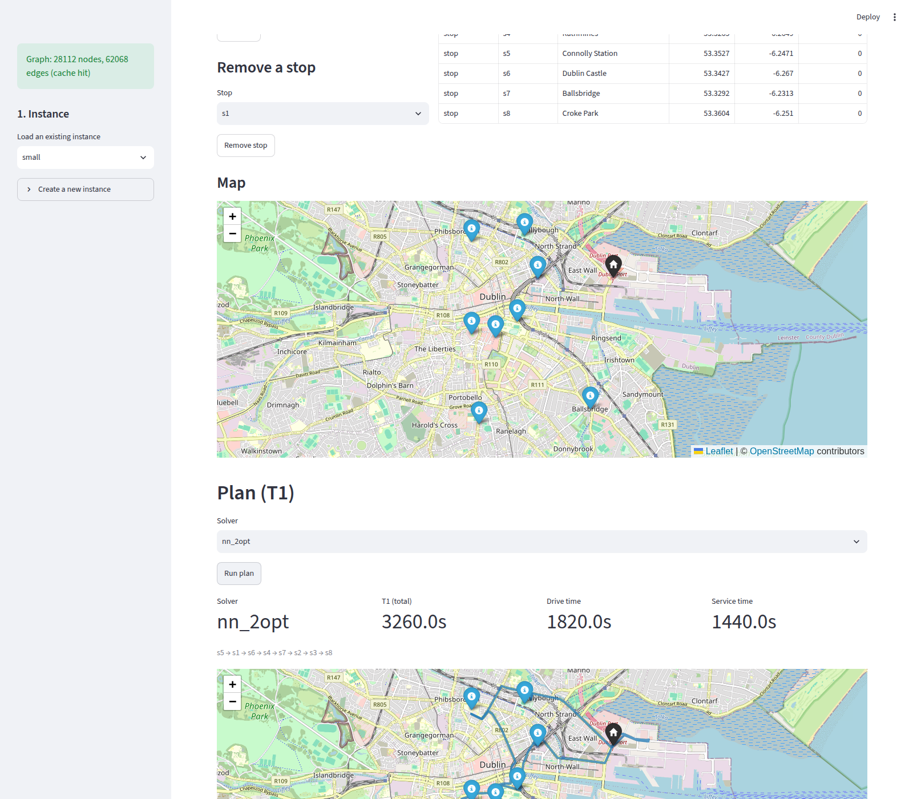
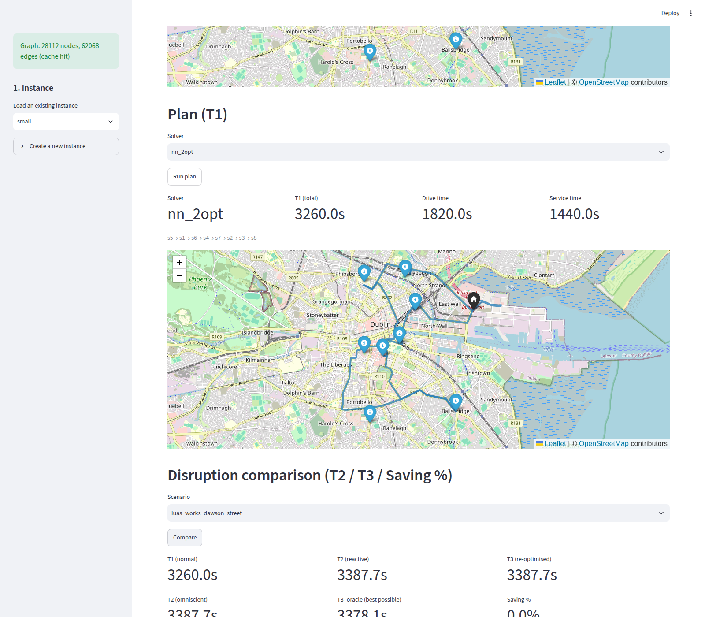
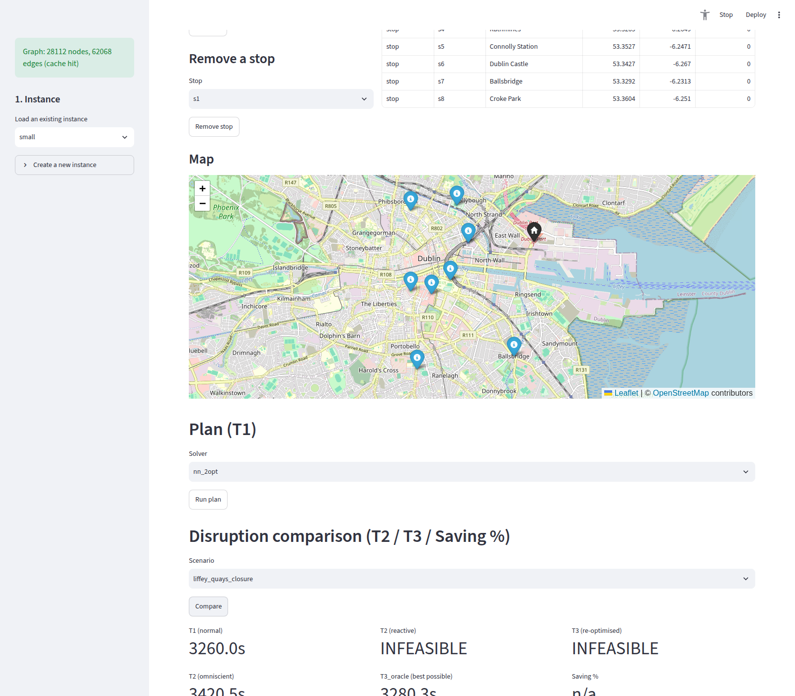

# Stage 10 — UI

## Goal

Build the Streamlit front end the project has been describing since
Stage 0 as "built last, thin client only": a single scrolling page over
the exact `dlm.*` pipeline every CLI command already calls, exposing
instance building, `T1` planning, and disruption comparison (`T2`/`T3`/
`Saving %`) with interactive Folium maps — and prove, not just assert,
that it stays a thin client via `tests/test_cli_ui_parity.py`.

## Scope

**In scope:**
- `app/state.py`: `st.session_state` helpers plus thin orchestration
  functions (`run_plan`, `run_compare`, instance CRUD, listings) that
  call `dlm.*` library functions in the same order `dlm.cli` does.
- `app/main.py`: the Streamlit page — sidebar instance selector/creator,
  add/remove-stop controls (preset/address/lat-lon/random/map-click),
  an instance map, a plan section (`T1` + route map, single-vehicle or
  fleet), and a disruption section (scenario picker, `T1`/`T2`
  (both information models)/`T3`/`T3_oracle`/`Saving %` + before/after
  maps).
- `make app`, wired to `streamlit run app/main.py` (was a Stage 0 stub).
- `tests/test_cli_ui_parity.py`: runs `dlm plan`/`dlm compare` in-process
  via `typer.testing.CliRunner`, reads the `result.json` each writes, and
  asserts `app.state.run_plan`/`run_compare` produce identical numbers
  for the same inputs — single-vehicle, fleet, and a disruption
  comparison, plus the fleet-instance rejection `dlm compare` has no
  code path for at all.

**Explicitly out of scope:**
- Fleet-aware disruption comparison — `app.state.run_compare` raises the
  same "unsupported" outcome `dlm compare` would (there is no CLI command
  to be a thin client *over* for this case — Stage 8's documented
  limitation, `docs/limitations.md`).
- `app/pages/`: the plan from Stage 0 ("a single scrolling page... this
  directory is only used if that becomes unwieldy") held — one page was
  enough.

## Design

**Every number on the page comes from a `dlm.*` function call, never a
re-implementation.** `app/state.py`'s docstring states this as its
contract, not just a preference: `run_plan` is the same sequence of
`InstanceBuilder.load(...).build()` -> `build_matrix` -> solver-dispatch
-> `compute_t1`/`compute_fleet_t1` that `dlm.cli.plan`/`_plan_fleet` run;
`run_compare` mirrors `dlm.cli.compare` the same way, down to reusing the
same `SOLVERS` dict and default solver name. `app/main.py` never imports
`dlm.instance`/`dlm.solver`/`dlm.simulation`/`dlm.disruption` directly —
only `app.state` and `dlm.viz.folium_map`'s `render_*` functions (map
rendering, not domain logic — `dlm.cli` imports the same `render_*`/
`save_*` pair for exactly the same reason).

**Map-click-to-add-a-stop is real, not a stub.** `InstanceBuilder`'s
`add_stop_from_latlon`/`set_depot_from_latlon` have taken an explicit
`source: StopSource` parameter since Stage 2 specifically "so Stage 10's
map-click handler can reuse them directly" (`builder.py`'s own
docstring). `app/main.py` wires `streamlit_folium.st_folium`'s
`last_clicked` return value through to `app.state.add_stop(..., kind=
"map_click", ...)`, which tags the resulting `Stop` with
`StopSource.MAP_CLICK` — the exact mechanism that comment promised,
landing in the stage it named.

**Parity is tested against the real CLI process path, not a mock.**
`test_cli_ui_parity.py` uses `typer.testing.CliRunner` to invoke
`dlm.cli.app` in-process (no subprocess — faster, and still the real
Typer command dispatch, argument parsing, and file-writing code path),
parses the `written to:` line every `plan`/`compare` invocation prints,
reads the `result.json` that run actually wrote to `results/`, and
compares every field against what `app.state.run_plan`/`run_compare`
independently computed for the same instance/scenario. This is the
concrete form of the architectural law in `docs/architecture.md` ("the
same inputs through the CLI and through the UI's underlying function
calls must produce identical `T1`/`T2`/`T3`"), not just a comment
restating it.

**A sandbox network constraint, not an application bug, blocked the
first render attempt.** The same class of issue Stage 2 already
documented (`experiments/render_map_screenshot.py`'s docstring: "headless
Chromium's own networking cannot reach external CDNs directly... even
pointing Chromium explicitly at the working `HTTPS_PROXY` does not fix
it") reappeared here: `streamlit_folium.st_folium`'s iframe embeds
Leaflet's JS/CSS from a CDN, which failed to load in this sandbox,
leaving the custom component's `Streamlit.setFrameHeight()` callback
never called and the iframe collapsed to `height: 0`. Confirmed harmless
to the real application (not a code defect) by re-running the same
Playwright session with the existing `curl`-backed CDN proxy technique
from `render_map_screenshot.py`: the iframe reported its correct
`height: 450` and the map rendered fully (see Results). On a normal
internet-connected machine — which is what `make app` actually runs
on — this workaround is unnecessary, exactly as that script's own
docstring already says for the static-HTML case.

## Interfaces

New: `app/state.py` (public functions listed in its `__all__`),
`app/main.py` (not an importable interface — a Streamlit script),
`tests/test_cli_ui_parity.py`. `make app` now runs `streamlit run
app/main.py` instead of exiting 1.

## Data & assumptions

No new data. The UI operates on the same committed instances
(`data/instances/*.json`), presets (`data/presets/dublin_locations.yaml`),
and curated scenario library (`scenarios/library/*.yaml`) every CLI
command uses.

## How to run

```bash
make app
```

Opens a Streamlit server (default `http://localhost:8501`). Pick or
create an instance in the sidebar, add stops, click "Run plan" for `T1`,
pick a scenario and click "Compare" for `T2`/`T3`/`Saving %`.

## Acceptance criteria and evidence

**CLI/UI parity, verified against the real CLI process path** (not
mocked):

```
$ pytest tests/test_cli_ui_parity.py -v
tests/test_cli_ui_parity.py::test_plan_parity_single_vehicle PASSED
tests/test_cli_ui_parity.py::test_plan_parity_fleet PASSED
tests/test_cli_ui_parity.py::test_compare_parity PASSED
tests/test_cli_ui_parity.py::test_compare_rejects_fleet_instance_same_as_cli_would PASSED
4 passed in 19.67s
```

**Full test suite, all 150 tests (146 through Stage 9 + 4 new parity
tests), unmodified elsewhere:**

```
$ pytest -q
150 passed in 164.47s (0:02:44)
```

**The UI actually runs in a browser** — `make app` launched, driven with
headless Chromium (Playwright) through the golden path: load the `small`
instance, view its map, run the plan, pick a scenario, compare.







**Edge case: an infeasible `T2`/`T3` renders correctly, not as a crash or
a stack trace** — `small` under `liffey_quays_closure` (one of the eight
`(instance, scenario)` combinations Stage 7's batch found infeasible,
`docs/report/batch_results.csv`):



Every number in these screenshots matches what `dlm plan --instance
small` / `dlm compare --instance small --scenario
luas_works_dawson_street` print on the command line for the same inputs
— the same fact the parity tests check automatically, shown here as a
human-visible screenshot instead of an assertion.

**`make app` no longer stubs out:**

```
$ make app
# (before) make app: lands in Stage 10 (docs/stages/stage-10-ui.md) ; exit 1
# (after)  starts a real Streamlit server on :8501
```

## Results

| Check | Result |
|---|---|
| CLI/UI parity tests | 4/4 pass |
| Full suite | 150/150 pass |
| Golden path (load -> plan -> compare) in a real browser | works, screenshotted |
| Infeasible `T2`/`T3` edge case in the UI | renders `INFEASIBLE`, no crash |
| Map-click-to-add-stop | wired to `StopSource.MAP_CLICK`, as designed since Stage 2 |

## Known limitations

- **Disruption comparison has no fleet-aware path**, matching `dlm
  compare` itself (Stage 8's documented limitation) — `app.state
  .run_compare` raises a clear `ValueError` for `fleet_size > 1` rather
  than silently producing a wrong number; the UI surfaces this as an
  `st.info` message instead of letting the button do nothing.
- **The map-click-to-add-stop flow requires a confirm step** (click the
  map, then click "Add as stop here") rather than adding instantly on
  click — a deliberate choice: `st_folium`'s `last_clicked` value persists
  across reruns until a genuinely new coordinate is clicked, so adding
  immediately on every rerun risked silently re-adding the same stop.
- **No authentication, multi-user session isolation beyond Streamlit's
  own per-browser-tab `session_state`, or persistence across a server
  restart beyond the instance/scenario files already on disk** — this is
  coursework software for one user driving one pipeline, not a deployed
  multi-tenant service; out of scope by the project's own brief.
- **The Leaflet/Folium map requires the browser to reach a map-tile and
  JS CDN** — true of Folium since Stage 2, not new here. On this
  project's own sandboxed dev/CI environment specifically, that requires
  the same `curl`-backed proxy technique `experiments/
  render_map_screenshot.py` already uses for static-HTML screenshots
  (used here only to capture this doc's evidence); a normal
  internet-connected machine running `make app` needs no such workaround.

## Next

This is the last stage in the original ten-stage build plan (0-10). What
would come after, if the project continued: `app/pages/` if the single
page ever becomes unwieldy (deliberately not built now — Stage 0's own
plan said only build it if needed, and one page was enough); a
fleet-aware `T2`/`T3` disruption model (Stage 8's and this stage's shared
open limitation); and revisiting `dlm batch`'s per-scenario graph
recomputation (Stage 7's documented cost) if the batch grid ever grows
past this project's scale.
